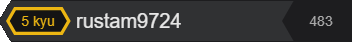

# JavaScript Front-end Developer
## My stack

## My projects

[react-admin](https://rustam9724.github.io/react-admin/) - An application that helps the restaurant administrator to make his work much faster, more efficient and more enjoyable

[food-project](https://rustam9724.github.io/food-project) - This project is a single page application, with which you can choose a dish to your taste from the presented categories

[random-app](https://rustam9724.github.io/random-app/) - Randomizer with the ability to get a random number, password, date, letter and even color!

[shelter](https://rustam9724.github.io/shelter/pages/main/index.html "shelter") - a site with which you can save the life of an animal

[tic-tac-toe](https://rustam9724.github.io/tic-tac-toe/) - good old tic-tac-toe to pass the time for you and your friends

[IAC](https://rustam9724.github.io/IAC/) - compressor company website

[tarixmanba](https://rustam9724.github.io/tarixmanba/) - website of the travel company of Uzbekistan

[emarat](https://rustam9724.github.io/emarat/) - fuel oil manufacturer website

[react-movies](https://rustam9724.github.io/movies-project/) - Find information about a movie you're interested in

[memory-games](https://rustam9724.github.io/memory-game/) - kill two birds with one stone - have fun and train your memory!

[room](https://rustam9724.github.io/room/dist/index.html) - Website for a design company that designs rooms

[react-shop](https://rustam9724.github.io/react-shop-project/) - React training project, which is an online store with an interactive shopping cart

## My certificates

* The Rolling scopes school: [JS/FE PRE-SCHOOL 2022 (JAVASCRIPT)](https://app.rs.school/certificate/c9h8em50 "JS/FE PRE-SCHOOL 2022 (JAVASCRIPT)")

## My contacts

